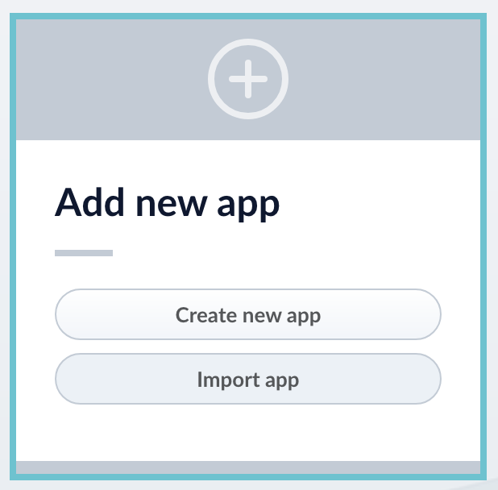
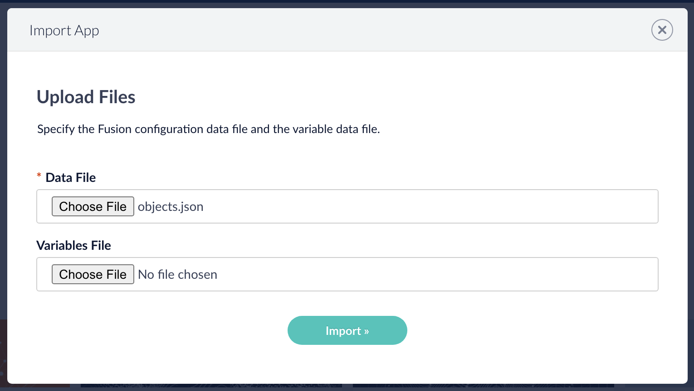
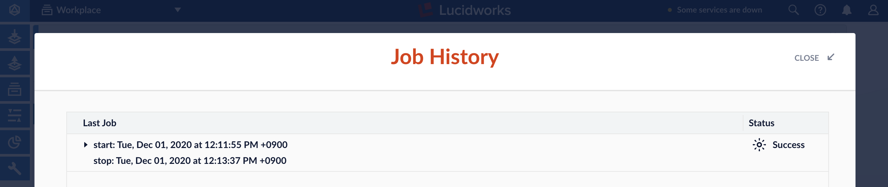
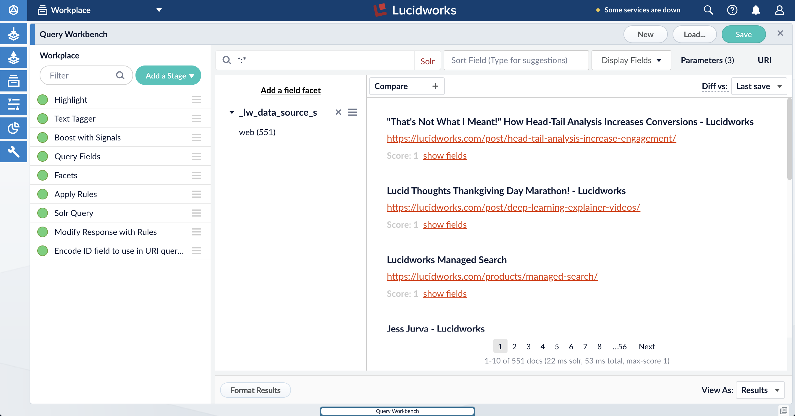
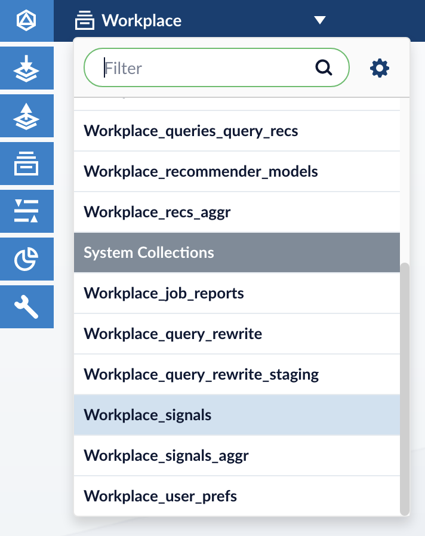
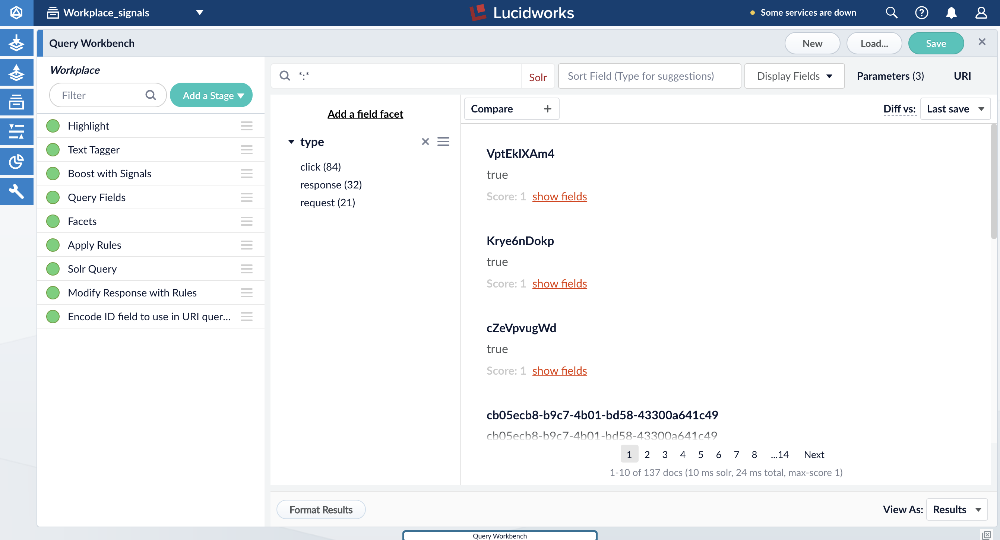
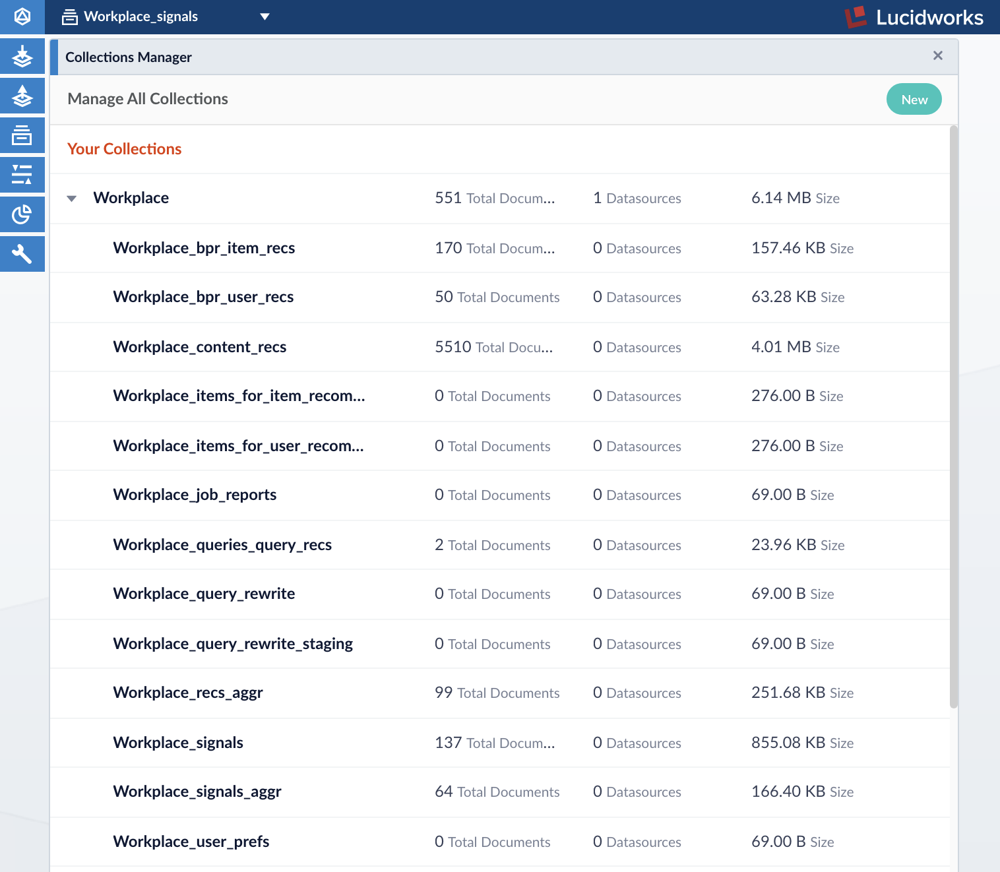
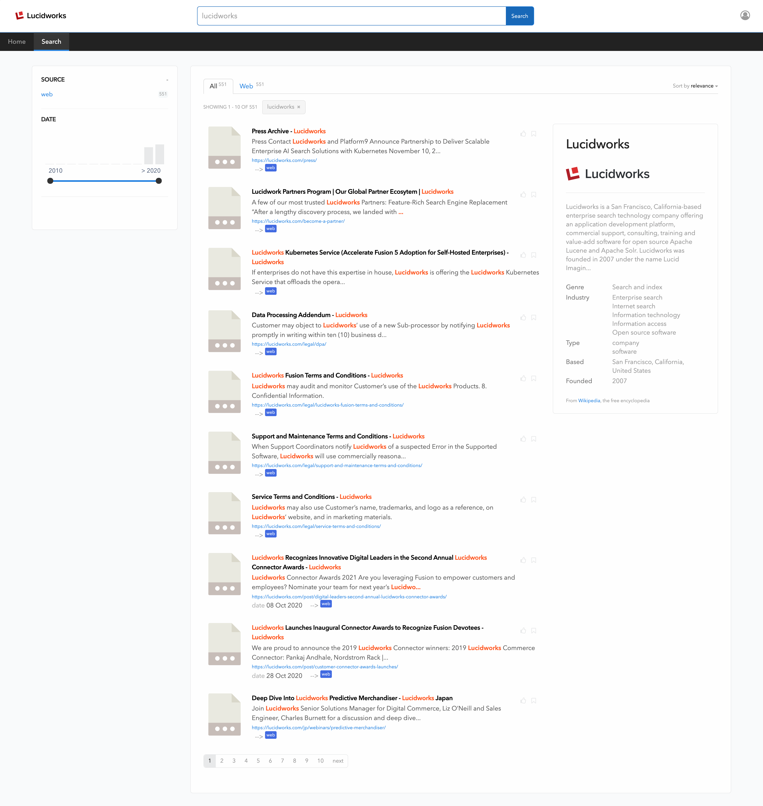
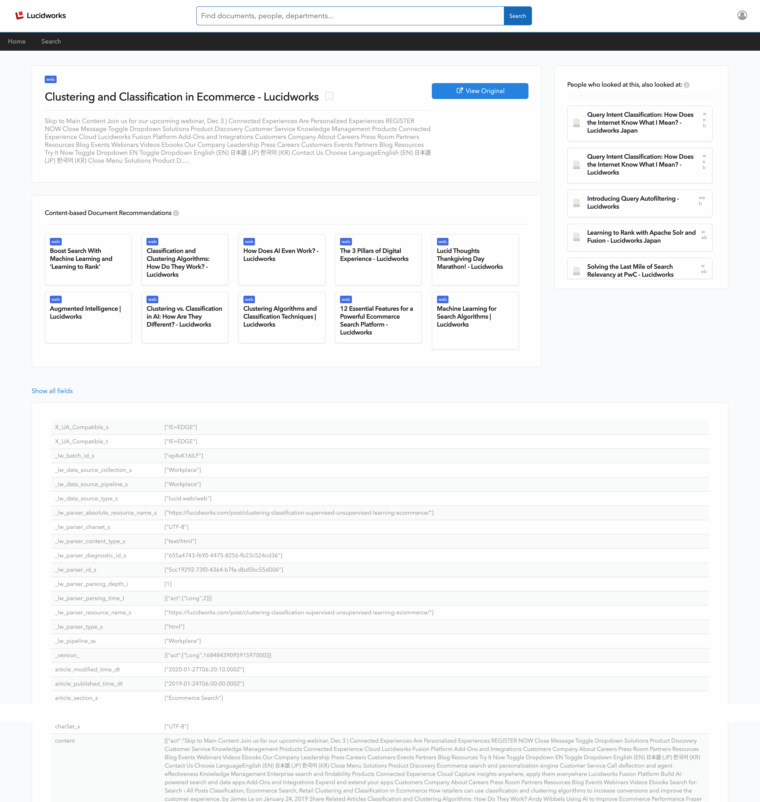

cat README.md
# Partner Demo Kit

Updated : Jan 12, 2021

- [한글](readme-lang/README-KO.md)
- [日本語READMEはこちら](readme-lang/README-JA.md)

**Table of Contents**

- [Partner Demo Kit](#partner-demo-kit)
  - [License](#license)
  - [Introduction](#introduction)
  - [Get Started](#get-started)
    - [1. Install Fusion](#1-install-fusion)
    - [2. Prepare Fusion App Template](#2-prepare-fusion-app-template)
    - [3. Import Fusion App Template](#3-import-fusion-app-template)
    - [4. Crawl Web Data](#4-crawl-web-data)
    - [5. Generate Signals](#5-generate-signals)
    - [6. Generate Recommendations](#6-generate-recommendations)
    - [7. Start App Studio](#7-start-app-studio)


___

## Introduction

This is a starter demo template for Lucidworks partners. It contains a pre-configured Fusion App and an end user search application built using Lucidworks' App Studio.

## License

App Studio Enterprise comes with a 30-day trial license in `app-studio.lic`. Once this expires, contact your regional Lucidworks representative or contact Lucidworks via the website for a new license: https://lucidworks.com/company/contact/.

## Get Started

### 1. Install Fusion

This starter demo template was created using Fusion 5.3. You could try to use this on later versions of Fusion 5, but there is no guarantee that it will work.

For instuctions on installing Fusion 5, see [Fusion Cloud Native on Kubernetes](https://github.com/lucidworks/fusion-cloud-native).

### 2. Prepare Fusion App Template

1. chmod [setup.sh](./setup.sh)

    Modify the access permission of `setup.sh` file.

    ```sh
    chmod +x setup.sh
    ```

2. Run the [setup.sh](./setup.sh) script

    This `setup.sh` script will only change the parameters according to your environent provided below. (this will not actually start installing apps or any modules)

    To run the script, there are five mandatory values that you must have ready:
    * -h : the fusion hostname (e.g. localhost)
    * -p : the fusion port (e.g. 6764)
    * -s : the protocol of your Fusion server (http or https)
    * -a : the fusion app name (a new name for you to define )
    * -t : the title to use on the search and pages (a title for your search UI)

    **Note: If the fusion app name contains any whitespaces, they will be replaced with underscores. Also, for the fusion app name, use a short name or acronym as it gets prefixed to many configuration names such as Query Profiles, Query Pipelines, Jobs, and others.**

    ```sh
    # Sample Commands
    # Nike
    $ ./setup.sh -h 'my.fusionhost.com' -p 6764 -s 'http' -a 'Nike' -t 'Nike Online'

    # Digital Workplace
    $ ./setup.sh -h 'my.fusionhost.com' -p 6764 -s 'https' -a 'Workplace' -t 'Digital Workplace'

    # Hardware Supply Company
    $ ./setup.sh -h 'my.fusionhost.com' -p 6764 -s 'https' -a 'Hardware Supply' -t 'Hardware Supply'
    ```

    The setup script in the previous stage should have modified the contents of the [objects.json](./fusion-app/partnerkit/object.json) file to change all occurences of the Fusion App name from `partnerkit` to what you had defined.

    For example, if you ran:

    ```sh
    $ ./setup.sh -h 'my.fusionhost.com' -p 6764 -s 'http' -a 'Workplace' -t 'Digital Workplace'
    ```
    Your [objects.json](./fusion-app/partnerkit/object.json) file should have changed like so:

    | Before          | After         |
    | :-------------: |:-------------:|
    |||

### 3. Import Fusion App Template

> If you are unfamiliar with the Fusion Admin UI, see [General UI Overview](https://doc.lucidworks.com/fusion-server/5.3/concepts/general-ui-overview.html).

Create a new Fusion app by importing the app template.

1. Log in to your Fusion Admin UI
2. Click on **Import app**
    <!--  -->
    <br>
3. Choose `object.json ` for **Data File**
    <!--  -->
    <br>
4. Click **Import**
5. Check that the app has been imported successfully
    <br>

### 4. Crawl Web Data

This template includes the web crawling configuration from Lucidworks.com as the initial value.

> If you are unfamiliar with Fusion Datasources and Jobs, see [Datasources](https://doc.lucidworks.com/fusion-connectors/5.3/concepts/datasources.html) and [Jobs](https://doc.lucidworks.com/fusion-server/5.3/concepts/jobs/index.html). <br>
> Understanding of Fusion Datasources and Jobs is not required to get this demo set up, however.


1. Log in to your Fusion Admin UI
2. Enter your newly created Fusion App's workspace by clicking on it from the launcher
    <br>
3. From the left navigation, click on **INDEXING** > **Datasources**
    <br>
4. Click on the datasource, **web**

5. Click on **Run** > **Start**
    <br>
6. Go to **Job History** to view the job log
    <br>
7. Once the job ends, the status will change
    <br>
8. Navigate to **QUERYING** > **Query Workbench**
    <br>
9. If your datasource ran successfully, your query workbench should simulate search results similar to this:
    <br>


### 5. Generate Signals

> If you are unfamiliar with Signals, see [Signals Overview](https://doc.lucidworks.com/fusion-ai/5.3/concepts/signals-and-aggregations/signals/index.html). <br>
> Understanding of Signals is not required to get this demo set up, however.

1. Open the [generate-signals-threaded.py](./sample-code/generate-signals-threaded.py) file, located in the `sample-code` folder, in a text editor and change the following values:

    | Variable                | Description           |
    | :----------------       | :-------------------- |
    |**fusion_ip**            |Fusion host|
    |**fusion_port**          |Fusion port|
    |**fusion_user**          |Fusion username|
    |**fusion_password**      |Fusion password|
    |**fusion_app**           |Fusion App name|
    |**fusion_query_profile** |Query Profile that will process the main user query|
    |**fusion_collection**    |Collection that contains your searchable data|
    |**documentLabel**        |Name of the field containing the document label, usually file name or product name (Do not change this value if you're using the index pipeline provided in the template)|

    <br>

    For example, if you named your Fusion App "Workplace" in step [2. Prepare Fusion App Template](#2-prepare-fusion-app-template), the values for `fusion_app`, `fusion_query_profile`, `fusion_collection` will be "Workplace".

2. Run [generate-signals-threaded.py](./sample-code/generate-signals-threaded.py)

    ```sh
    $ python3 sample-code/generate-signals-threaded.py
    ```

3. Go to the Fusion Admin UI, click on the **Collection Picker** and select **[FUSION-APP-NAME]_signals**
    <br>

4. From the left navigation, click on **QUERYING** > **Query Workbench**
   <br>Check that the signals have been successfully gathered
    <br>

### 6. Generate Recommendations

> If you are unfamiliar with Recommendations, see [Recommendations and Boosting Overview](https://doc.lucidworks.com/fusion-ai/5.3/concepts/boosting/index.html). <br>
> Understanding of Recommendations is not required to get this demo set up, however.

Using the signals that we generated earlier, we'll create some data aggregations and  recommendations to enhance search relevance and experience. Navigate to **COLLECTIONS** > **Jobs** run the jobs below in the given order.

**Note: Only proceed with the next job *after* the current one has completed successfully.**

1. [FUSION-APP-NAME]_click_signals_aggregation
2. [FUSION-APP-NAME]_user_query_history_agg
3. [FUSION-APP-NAME]_user_item_prefs_agg
4. [FUSION-APP-NAME]_bpr_item_recs
5. [FUSION-APP-NAME]_content_recs
6. [FUSION-APP-NAME]_query_recs

Once you've run all the jobs, go to **COLLECTIONS** > **Collection Manager** and see that other collections now have documents.

Example:
<br>

### 7. Start App Studio

> If you are unfamiliar with App Studio, see [Fusion App Studio](https://doc.lucidworks.com/app-studio/latest/index.html). <br>
> Understanding of App Studio is not required to get this demo set up, however.

Use the start method below during development and for production, package your search application in a Java WAR file or Java JAR file. For more information, see [Deployment Overview](https://doc.lucidworks.com/app-studio/4.2/reference/app-deployment/index.html).

**Note: `npm` is required to run App Studio**

To install `npm`:
```
$ curl -sL https://rpm.nodesource.com/setup_12.x | sudo bash -
$ sudo yum install nodejs
```

To start App Studio go in to the folder `app-studio` and start:
```
$ cd app-studio/
$ ./app-studio start -t 300
```

Note that the `-t` flag is optional and is used to set the start timeout in seconds. Default timeout is 240 seconds which may not be enough when starting App Studio for the first time as various modules need to get downloaded initially.

**Example screenshots of App Studio search UI**

|Summary Page |
|:-----------:|
||

|Main Search Page | Search Detail Page|
|-----------|---------------|
|||

|Typeahead |
|-----------|
||
