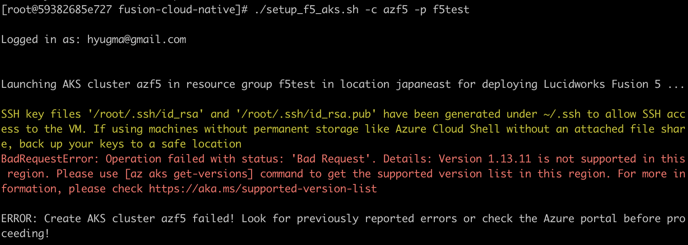

# Creating Fusion 5 on Azure

詳細は、[Fusion Cloud Native中のReadme中のAKS項目](https://github.com/lucidworks/fusion-cloud-native/blob/master/README.adoc#azure-kubernetes-aks)を参照してください。

## What's this?

Microsoft AzureのKubernetes Service上にFusion5を起動させるための手順ノートです。

細かい説明は省いて、まずはfusion5を起動させることだけにフォーカスしていますので、
細かい設定内容の説明や設定内容のカスタマイズ、性能やセキュリティに関する注意点、
その他検討事項は、上のReadmeやドキュメントを参照ください。

---

自分の作業PCを汚さず、DockerのCentOSコンテナを作業端末として設定して実行。

予めAzureへのアカウントは取得しておくこと。

---

DockerでCentOSを準備

```bash
# centos7で作業することにする。
# centos7のイメージをpull
docker pull centos:centos7
# pullしたコンテナを"mycentos"という名前で起動起動
docker run -it -d --name mycentos centos:centos7
# シェルへ入る。
docker exec -it mycentos /bin/bash
# ここからCentOSコンテナ上のシェル
# rootユーザのホームディレクトリで作業することにする。
cd ~
# 必要なコマンドをインストール
yum -y install git unzip wget
# kubectlコマンドを取得
curl -LO "https://storage.googleapis.com/kubernetes-release/release/$(curl -s https://storage.googleapis.com/kubernetes-release/release/stable.txt)/bin/linux/amd64/kubectl"
# kubectlコマンドに実行権限を与えてPathが通っているディレクトリへ移動させる
chmod +x kubectl
mv kubectl /usr/local/bin/
kubectl help
# helmコマンドを取得取得して実行できるようにする。
wget https://get.helm.sh/helm-v3.4.1-linux-amd64.tar.gz
tar xvfz helm-v3.4.1-linux-amd64.tar.gz
mv linux-amd64/helm /usr/local/bin/
helm help
# az cliをインストール、以下参照
# https://docs.microsoft.com/en-us/cli/azure/install-azure-cli-yum
rpm --import https://packages.microsoft.com/keys/microsoft.asc
echo -e "[azure-cli]
name=Azure CLI
baseurl=https://packages.microsoft.com/yumrepos/azure-cli
enabled=1
gpgcheck=1
gpgkey=https://packages.microsoft.com/keys/microsoft.asc" | tee /etc/yum.repos.d/azure-cli.repo
yum -y install azure-cli
# cliにAzureログイン情報を登録する。
az login
# 上を実行すると、次のようなメッセージがでてくるので、ブラウザで 
# https://microsoft.com/devicelogin にアクセスしてメッセージ中のCodeを入れて進める。
# To sign in, use a web browser to open the page https://microsoft.com/devicelogin and enter the code XXXXXXXXX to authenticate.
# ブラウザからログイン実行後に、"デバイスの Microsoft Azure Cross-platform Command Line Interface アプリケーションにサインインしました。このウィンドウは閉じてかまいません。"と出てくる。

# fusionをまとめておくためのリソースグループを作成
# "f5test"という名前のリソースグループを東日本リージョンに作成
az group create -g f5test -l japaneast
# azure ポータルからリソースグループが作成されているか確認すると安心。

# fusionの構築に便利なスクリプト一式をgit cloneしてコンテナに持ってくる
git clone https://github.com/lucidworks/fusion-cloud-native.git
cd fusion-cloud-native/
# 各種k8s関連サービスむけのスクリプトが用意されている。Azure用の以下を実行
./setup_f5_aks.sh -c azf5 -p f5test

```




"Version 1.13.11 is not supported in this region" と怒られるので、もう少し新しいバージョンを指定して実行。

```bash
vi setup_f5_aks.sh
# AKS_MASTER_VERSION="1.13.11" を編集し、1.18.10 等に変更
./setup_f5_aks.sh -c azf5 -p f5test
```

もし以下の様に、クオタ制限のメッセージが出るようであれば、必要に応じで、Azureのサポートケースからクオタを引き上げてもらう必要がある。

```bash
BadRequestError: Operation failed with status: 'Bad Request'. Details: Provisioning of resource(s) for container service f5 in resource group rg1 failed. Message: Operation could not be completed as it results in exceeding approved Total Regional Cores quota. Additional details - Deployment Model: Resource Manager, Location: japaneast, Current Limit: 10, Current Usage: 0, Additional Required: 12, (Minimum) New Limit Required: 12. Submit a request for Quota increase at https://aka.ms/ProdportalCRP/?#create/Microsoft.Support/Parameters/{"subId":"024b00dc-136b-441c-888e-56e632bdd0d9","pesId":"06bfd9d3-516b-d5c6-5802-169c800dec89","supportTopicId":"e12e3d1d-7fa0-af33-c6d0-3c50df9658a3"} by specifying parameters listed in the \u2018Details\u2019 section for deployment to succeed. Please read more about quota limits at https://docs.microsoft.com/en-us/azure/azure-supportability/regional-quota-requests.. Details:
```


おそらく、少量のクオタ制限増量であれば、すぐに承認されるので、再度setupスクリプトを実行する。

以下、実行時の出力情報

```bash
[root@59382685e727 fusion-cloud-native]# ./setup_f5_aks.sh -c azf5 -p f5test

Logged in as: hyugma@gmail.com

Launching AKS cluster azf5 in resource group f5test in location japaneast for deploying Lucidworks Fusion 5 ...

AAD role propagation done[############################################]  100.0000%{
  "aadProfile": null,
  "addonProfiles": {
    "KubeDashboard": {
      "config": null,
      "enabled": false,
      "identity": null
    },
    "httpApplicationRouting": {
      "config": {
        "HTTPApplicationRoutingZoneName": "1207adddd4c742fe95a7.japaneast.aksapp.io"
      },
      "enabled": true,
      "identity": {
        "clientId": "e1610349-ddfb-44aa-976f-26619eb9276b",
        "objectId": "5690b3c5-6a06-4ed1-8c15-f30c2a946f3d",
        "resourceId": "/subscriptions/024b00dc-136b-441c-888e-56e632bdd0d9/resourcegroups/MC_f5test_azf5_japaneast/providers/Microsoft.ManagedIdentity/userAssignedIdentities/httpapplicationrouting-azf5"
      }
    },
    "omsagent": {
      "config": {
        "logAnalyticsWorkspaceResourceID": "/subscriptions/024b00dc-136b-441c-888e-56e632bdd0d9/resourcegroups/defaultresourcegroup-ejp/providers/microsoft.operationalinsights/workspaces/defaultworkspace-024b00dc-136b-441c-888e-56e632bdd0d9-ejp"
      },
      "enabled": true,
      "identity": {
        "clientId": "bbf47f38-90e2-481c-a0e3-86a49683c562",
        "objectId": "9df54304-16d4-433b-b0ce-58ca7a41f7af",
        "resourceId": "/subscriptions/024b00dc-136b-441c-888e-56e632bdd0d9/resourcegroups/MC_f5test_azf5_japaneast/providers/Microsoft.ManagedIdentity/userAssignedIdentities/omsagent-azf5"
      }
    }
  },
  "agentPoolProfiles": [
    {
      "availabilityZones": null,
      "count": 3,
      "enableAutoScaling": null,
      "enableNodePublicIp": false,
      "maxCount": null,
      "maxPods": 110,
      "minCount": null,
      "mode": "System",
      "name": "nodepool1",
      "nodeImageVersion": "AKSUbuntu-1804-2020.12.01",
      "nodeLabels": {},
      "nodeTaints": null,
      "orchestratorVersion": "1.18.10",
      "osDiskSizeGb": 128,
      "osDiskType": "Managed",
      "osType": "Linux",
      "powerState": {
        "code": "Running"
      },
      "provisioningState": "Succeeded",
      "proximityPlacementGroupId": null,
      "scaleSetEvictionPolicy": null,
      "scaleSetPriority": null,
      "spotMaxPrice": null,
      "tags": null,
      "type": "VirtualMachineScaleSets",
      "upgradeSettings": null,
      "vmSize": "Standard_D4_v3",
      "vnetSubnetId": null
    }
  ],
  "apiServerAccessProfile": null,
  "autoScalerProfile": null,
  "diskEncryptionSetId": null,
  "dnsPrefix": "azf5-f5test-024b00",
  "enablePodSecurityPolicy": null,
  "enableRbac": true,
  "fqdn": "azf5-f5test-024b00-93575a93.hcp.japaneast.azmk8s.io",
  "id": "/subscriptions/024b00dc-136b-441c-888e-56e632bdd0d9/resourcegroups/f5test/providers/Microsoft.ContainerService/managedClusters/azf5",
  "identity": {
    "principalId": "7efd8383-5cb5-4b6c-a4e4-a513b01742a6",
    "tenantId": "18241398-3a2f-4088-820a-a1ceb4891578",
    "type": "SystemAssigned",
    "userAssignedIdentities": null
  },
  "identityProfile": {
    "kubeletidentity": {
      "clientId": "568433a9-9ee6-4b38-b988-a152d6c79af2",
      "objectId": "6875840a-b250-4cb0-8200-af9c8e862b90",
      "resourceId": "/subscriptions/024b00dc-136b-441c-888e-56e632bdd0d9/resourcegroups/MC_f5test_azf5_japaneast/providers/Microsoft.ManagedIdentity/userAssignedIdentities/azf5-agentpool"
    }
  },
  "kubernetesVersion": "1.18.10",
  "linuxProfile": {
    "adminUsername": "azureuser",
    "ssh": {
      "publicKeys": [
        {
          "keyData": "ssh-rsa AAAAB3NzaC1yc2EAAAADAQABAAABAQDWX6EI2qMPJ2OPVkm9mEjy4fwAsGaaiRZ3cRGOgX6eHM6s3CtvU1HXaxU46eBfExx9Xt4/o4lO9c/zjFLrZ2DkxJeXp18CPSuY5oXjJdpFq0XTiaOKcv9X23SkfR7IvPlqtcB6W2BVDbM17E7+FVsqgLrHCdFbvTV5RMiT/Af+JhnHUMalUa43Q/nDyROS9pfGSk1zbu2Zrcnuc01tyZjkGDljOLjSO6fOnbBqP7kbQoLA7/XOiI6+shGgBdEcIVAcRRg8BTmFE2EpN/8n84Lew5W4LK+SYRasHV7MEwqFDMzGz6uojEn2TEimDXiXOO6E63/1U61pDtbeuV+7jwfh"
        }
      ]
    }
  },
  "location": "japaneast",
  "maxAgentPools": 10,
  "name": "azf5",
  "networkProfile": {
    "dnsServiceIp": "10.0.0.10",
    "dockerBridgeCidr": "172.17.0.1/16",
    "loadBalancerProfile": {
      "allocatedOutboundPorts": null,
      "effectiveOutboundIps": [
        {
          "id": "/subscriptions/024b00dc-136b-441c-888e-56e632bdd0d9/resourceGroups/MC_f5test_azf5_japaneast/providers/Microsoft.Network/publicIPAddresses/aac91405-dd4a-4401-81bb-fd5b96e61b18",
          "resourceGroup": "MC_f5test_azf5_japaneast"
        }
      ],
      "idleTimeoutInMinutes": null,
      "managedOutboundIps": {
        "count": 1
      },
      "outboundIpPrefixes": null,
      "outboundIps": null
    },
    "loadBalancerSku": "Standard",
    "networkMode": null,
    "networkPlugin": "kubenet",
    "networkPolicy": null,
    "outboundType": "loadBalancer",
    "podCidr": "10.244.0.0/16",
    "serviceCidr": "10.0.0.0/16"
  },
  "nodeResourceGroup": "MC_f5test_azf5_japaneast",
  "powerState": {
    "code": "Running"
  },
  "privateFqdn": null,
  "provisioningState": "Succeeded",
  "resourceGroup": "f5test",
  "servicePrincipalProfile": {
    "clientId": "msi",
    "secret": null
  },
  "sku": {
    "name": "Basic",
    "tier": "Free"
  },
  "tags": null,
  "type": "Microsoft.ContainerService/ManagedClusters",
  "windowsProfile": null
}

Cluster 'azf5' deployed ... testing if it is healthy
Merged "azf5-admin" as current context in /root/.kube/config
azf5-admin
clusterrolebinding.rbac.authorization.k8s.io/cluster-admin-binding created
Using Helm V3 (v3.4.1+gc4e7485)
node/aks-nodepool1-25462019-vmss000000 labeled
node/aks-nodepool1-25462019-vmss000001 labeled
node/aks-nodepool1-25462019-vmss000002 labeled
Using kubeconfig: azf5-admin
Using Helm v3 (v3.4.1+gc4e7485)
Found at least one healthy node matching nodeSelector: fusion_node_type: system

Created Fusion custom values yaml: aks_azf5_f5_fusion_values.yaml

Created Monitoring custom values yaml: aks_azf5_f5_monitoring_values.yaml. Keep this file handy as you'll need it to customize your Monitoring installation.

Create aks_azf5_f5_upgrade_fusion.sh for upgrading you Fusion cluster. Please keep this script along with your custom values yaml file(s) in version control.

Error: no repositories to show

Adding the stable chart repo to helm repo list
Error: repo "https://kubernetes-charts.storage.googleapis.com" is no longer available; try "https://charts.helm.sh/stable" instead

Installing Prometheus and Grafana for monitoring Fusion metrics ... this can take a few minutes.

Getting updates for unmanaged Helm repositories...
...Successfully got an update from the "https://kubernetes-charts.storage.googleapis.com" chart repository
...Successfully got an update from the "https://kubernetes-charts.storage.googleapis.com" chart repository
Saving 2 charts
Downloading prometheus from repo https://kubernetes-charts.storage.googleapis.com
Downloading grafana from repo https://kubernetes-charts.storage.googleapis.com
Deleting outdated charts
Release "f5-monitoring" does not exist. Installing it now.
NAME: f5-monitoring
LAST DEPLOYED: Mon Dec 14 12:20:35 2020
NAMESPACE: default
STATUS: deployed
REVISION: 1
NOTES:
1. Get your 'admin' user password by running:

   kubectl get secret --namespace default f5-monitoring-grafana -o jsonpath="{.data.admin-password}" | base64 --decode ; echo

2. The Grafana server can be accessed via port 80 on the following DNS name from within your cluster:

   f5-monitoring-grafana.default.svc.cluster.local

   Get the Grafana URL to visit by running these commands in the same shell:

     export POD_NAME=$(kubectl get pods --namespace default -l "app=grafana,release=f5-monitoring" -o jsonpath="{.items[0].metadata.name}")
     kubectl --namespace default port-forward $POD_NAME 3000

3. Login with the password from step 1 and the username: admin

The Prometheus server can be accessed via port 80 on the following DNS name from within your cluster:
f5-monitoring-prometheus-server.default.svc.cluster.local

Get the Prometheus server URL by running these commands in the same shell:
  export POD_NAME=$(kubectl get pods --namespace default -l "app=prometheus,component=server" -o jsonpath="{.items[0].metadata.name}")
  kubectl --namespace default port-forward $POD_NAME 9090

#################################################################################
######   WARNING: Pod Security Policy has been moved to a global property.  #####
######            use .Values.podSecurityPolicy.enabled with pod-based      #####
######            annotations                                               #####
######            (e.g. .Values.nodeExporter.podSecurityPolicy.annotations) #####
#################################################################################

The Prometheus PushGateway can be accessed via port 9091 on the following DNS name from within your cluster:
f5-monitoring-prometheus-pushgateway.default.svc.cluster.local

Get the PushGateway URL by running these commands in the same shell:
  export POD_NAME=$(kubectl get pods --namespace default -l "app=prometheus,component=pushgateway" -o jsonpath="{.items[0].metadata.name}")
  kubectl --namespace default port-forward $POD_NAME 9091

For more information on running Prometheus, visit:
https://prometheus.io/

# Fusion Monitoring

Successfully installed Prometheus and Grafana into the default namespace.

NAME         	NAMESPACE	REVISION	UPDATED                              	STATUS  	CHART                  	APP VERSION
f5-monitoring	default  	1       	2020-12-14 12:20:35.7383827 +0000 UTC	deployed	fusion-monitoring-1.0.0	1.0.0

Installing Fusion 5.0 Helm chart 5.3.1 into namespace default with release tag: f5
Error: no repositories to show

Adding the Lucidworks chart repo to helm repo list
"lucidworks" has been added to your repositories
Hang tight while we grab the latest from your chart repositories...
...Successfully got an update from the "lucidworks" chart repository
Update Complete. ⎈Happy Helming!⎈
Upgrading the 'f5' release (Fusion chart: 5.3.1) in the 'default' namespace in the 'azf5' cluster using values:
      aks_azf5_f5_fusion_values.yaml

NOTE: If this will be a long-running cluster for production purposes, you should save the following file(s) in version control:
  aks_azf5_f5_fusion_values.yaml

Release "f5" does not exist. Installing it now.
coalesce.go:199: warning: destination for client is a table. Ignoring non-table value 2181
NAME: f5
LAST DEPLOYED: Mon Dec 14 12:23:00 2020
NAMESPACE: default
STATUS: deployed
REVISION: 1

Waiting up to 10 minutes to see the Fusion API Gateway deployment come online ...

Waiting for deployment spec update to be observed...
Waiting for deployment spec update to be observed...
Waiting for deployment "f5-api-gateway" rollout to finish: 0 of 1 updated replicas are available...
error: timed out waiting for the condition

Waiting up to 5 minutes to see the Fusion Indexing deployment come online ...

Waiting for deployment "f5-fusion-indexing" rollout to finish: 0 of 1 updated replicas are available...
error: deployment "f5-fusion-indexing" exceeded its progress deadline
Context "azf5-admin" modified.

NAME         	NAMESPACE	REVISION	UPDATED                              	STATUS  	CHART                  	APP VERSION
f5           	default  	1       	2020-12-14 12:23:00.1815474 +0000 UTC	deployed	fusion-5.3.1           	5.3.1
f5-monitoring	default  	1       	2020-12-14 12:20:35.7383827 +0000 UTC	deployed	fusion-monitoring-1.0.0	1.0.0

Fusion 5 Gateway service exposed at: 20.44.128.18:6764

WARNING: This IP address is exposed to the WWW w/o SSL! This is done for demo purposes and ease of installation.
You are strongly encouraged to configure a K8s Ingress with TLS, see:
   https://cloud.google.com/kubernetes-engine/docs/tutorials/http-balancer

After configuring an Ingress, please change the 'proxy' service to be a ClusterIP instead of LoadBalancer
```

上の最後に、 20.44.128.18:6764 とあるので、早速アクセスする。


AzureのポータルではいかのRGが作られている。


また、各種コンテナの状態は、k9sツールを使うと見やすい。

```bash
wget https://github.com/derailed/k9s/releases/download/v0.23.10/k9s_Linux_x86_64.tar.gz
tar xfz k9s_Linux_x86_64.tar.gz
mv k9s /usr/local/bin/
k9s
```


最後は、—purgeをつかってk8s上のコンテナを消す

```bash
[root@59382685e727 fusion-cloud-native]#  ./setup_f5_aks.sh -c azf5 -p f5test --purge

Logged in as: hyugma@gmail.com

Merged "azf5" as current context in /root/.kube/config
Using kubeconfig: azf5
Using Helm v3 (v3.4.1+gc4e7485)
NAME      STATUS   AGE
default   Active   37m

Are you sure you want to purge the f5 release from the default namespace in: azf5? This operation cannot be undone! Y/n Y
release "f5" uninstalled
release "f5-monitoring" uninstalled
Error: uninstall: Release not loaded: f5-prom: release: not found
Error: uninstall: Release not loaded: f5-graf: release: not found
warning: Immediate deletion does not wait for confirmation that the running resource has been terminated. The resource may continue to run on the cluster indefinitely.
No resources found
warning: Immediate deletion does not wait for confirmation that the running resource has been terminated. The resource may continue to run on the cluster indefinitely.
Error from server (NotFound): jobs.batch "f5-api-gateway" not found
warning: Immediate deletion does not wait for confirmation that the running resource has been terminated. The resource may continue to run on the cluster indefinitely.
service "proxy" force deleted
error: timed out waiting for the condition on services/proxy
warning: Immediate deletion does not wait for confirmation that the running resource has been terminated. The resource may continue to run on the cluster indefinitely.
persistentvolumeclaim "classic-rest-service-data-claim-f5-classic-rest-service-0" force deleted
warning: Immediate deletion does not wait for confirmation that the running resource has been terminated. The resource may continue to run on the cluster indefinitely.
persistentvolumeclaim "data-f5-zookeeper-0" force deleted
persistentvolumeclaim "data-f5-zookeeper-1" force deleted
persistentvolumeclaim "data-f5-zookeeper-2" force deleted
persistentvolumeclaim "f5-pulsar-bookkeeper-journal-f5-pulsar-bookkeeper-0" force deleted
persistentvolumeclaim "f5-pulsar-bookkeeper-journal-f5-pulsar-bookkeeper-1" force deleted
persistentvolumeclaim "f5-pulsar-bookkeeper-journal-f5-pulsar-bookkeeper-2" force deleted
persistentvolumeclaim "f5-pulsar-bookkeeper-ledgers-f5-pulsar-bookkeeper-0" force deleted
persistentvolumeclaim "f5-pulsar-bookkeeper-ledgers-f5-pulsar-bookkeeper-1" force deleted
persistentvolumeclaim "f5-pulsar-bookkeeper-ledgers-f5-pulsar-bookkeeper-2" force deleted
warning: Immediate deletion does not wait for confirmation that the running resource has been terminated. The resource may continue to run on the cluster indefinitely.
persistentvolumeclaim "f5-solr-pvc-f5-solr-0" force deleted
warning: Immediate deletion does not wait for confirmation that the running resource has been terminated. The resource may continue to run on the cluster indefinitely.
persistentvolumeclaim "storage-volume-f5-monitoring-prometheus-server-0" force deleted
Error from server (NotFound): serviceaccounts "f5-api-gateway-jks-create" not found
[root@59382685e727 fusion-cloud-native]#
```

使い終わったら、Azure ポータルからRGを部消せば一応関連するリソースは消えるようになると思う。

-