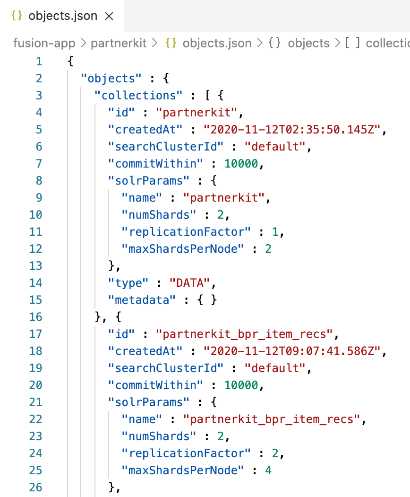
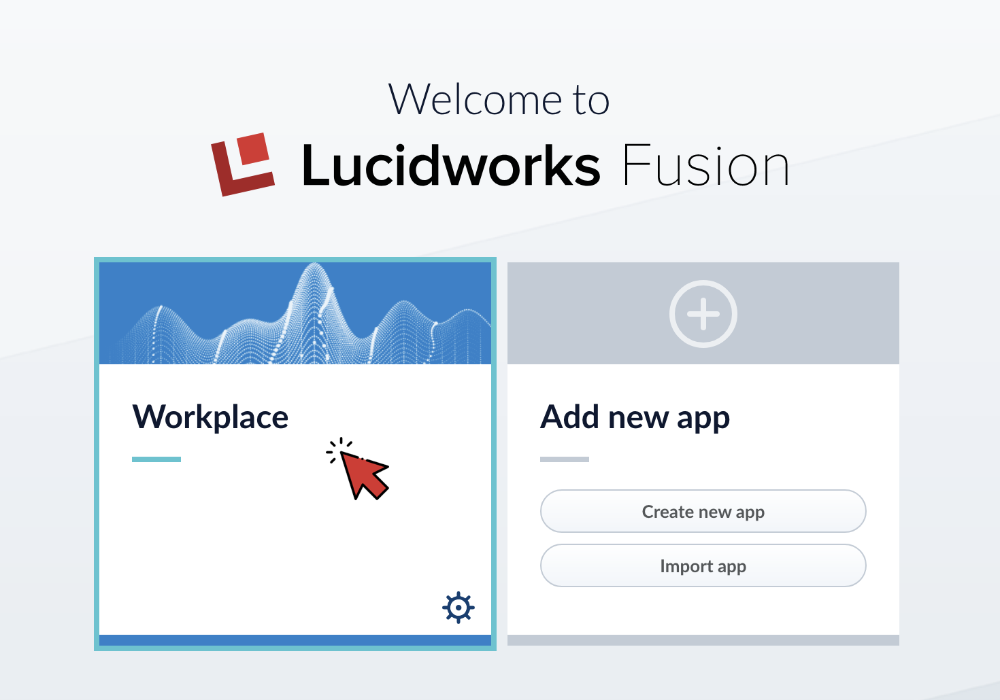
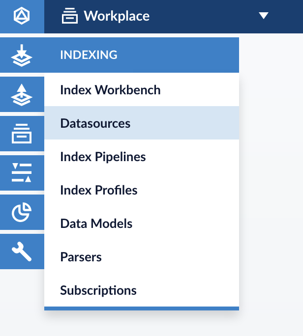
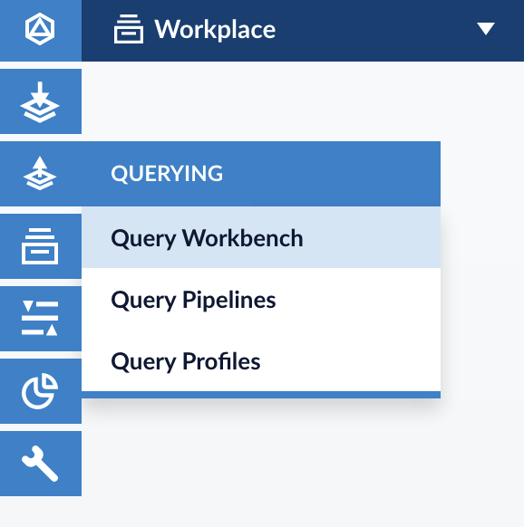
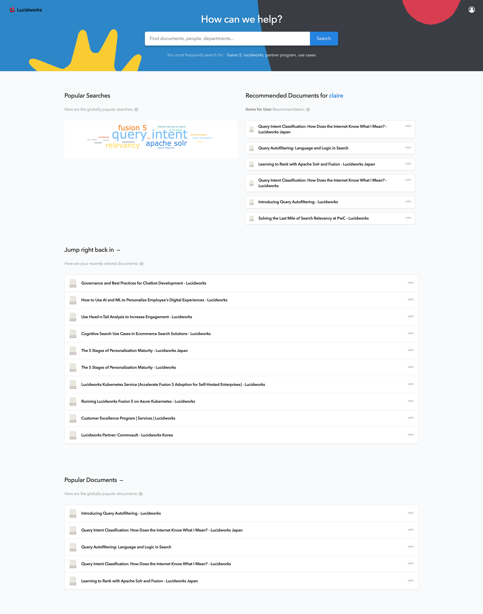
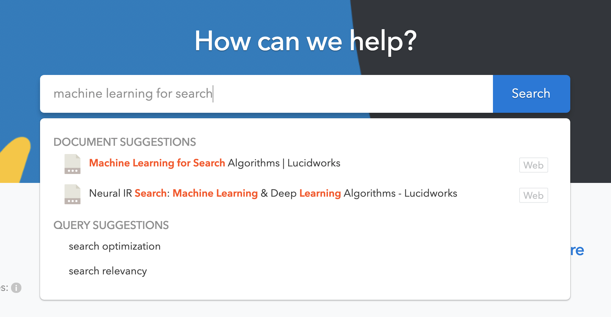

# パートナー デモキット

This is a Japanese Translation based on original readme updated on Dec 21, 2020.<br>
[English README.md is here](../README.md)

**~ もくじ ~**

- [パートナー デモキット](#パートナー-デモキット)
  - [はじめに](#はじめに)
  - [やってみよう](#やってみよう)
    - [1. Fusionのインストール](#1-fusionのインストール)
    - [2. Fusion App テンプレートの準備](#2-fusion-app-テンプレートの準備)
    - [3. Fusion App Templateのインポート](#3-fusion-app-templateのインポート)
    - [4. Webデータのクローリング](#4-webデータのクローリング)
    - [5. Signal(シグナル)データの生成](#5-signalシグナルデータの生成)
    - [6. レコメンドの生成](#6-レコメンドの生成)
    - [7. App Studioの起動](#7-app-studioの起動)

___

## はじめに

これはLucidworksパートナー向けのスターターデモテンプレートです。事前に構成されたフュージョンアプリケーションとLucidworksのアプリスタジオを使用して構築されたエンドユーザー検索アプリケーションが含まれています。

## やってみよう

### 1. Fusionのインストール

このスターターデモテンプレートは、Fusion 5.3 を使用して作成されました。より新しいFusion 5のバージョンで使用しようとすることもおそらく出来ますが、うまく動作しないこともあるかもしれません。 (><; 

Fusion 5 のインストールに関するインスタクションについては、[Fusion Cloud Native on Kubernetes](https://github.com/lucidworks/fusion-cloud-native) を参照してください。

### 2. Fusion App テンプレートの準備

1. chmod [setup.sh](./setup.sh) の実行

    `setup.sh` ファイルに実行権を付与する。

    ```sh
    chmod +x setup.sh
    ```

2. [setup.sh](./setup.sh) スクリプトの実行

    `setup.sh`スクリプトは、環境に従ってテンプレート内のファイルの必要なパラメータを変更するのみです。アプリやモジュールのインストール自体は実行しません。

    スクリプトを実行前に、以下の5つの値を事前に確認しておく必要があります。
    * -h : fusion host名 (例: localhost)
    * -p : fusion proxy ポート (例: 6764)
    * -s : fusion server プロトコル (http または https)
    * -a : fusion app名 (新しい名前を定義)
    * -t : 各検索ページで使用するタイトル (検索 UI のタイトル)

    **注: Fusion app名に空白が含まれている場合、アンダースコアに置き換えられます。また、fusion app名は、query profile、query pipeline、jobなど、多くの設定名の接頭詞として使用されます**

    ```sh
    # 実行例
    # Nike
    $ ./setup.sh -h 'my.fusionhost.com' -p 6764 -s 'http' -a 'Nike' -t 'Nike Online'

    # Digital Workplace
    $ ./setup.sh -h 'my.fusionhost.com' -p 6764 -s 'https' -a 'Workplace' -t 'Digital Workplace'

    # Hardware Supply Company
    $ ./setup.sh -h 'my.fusionhost.com' -p 6764 -s 'https' -a 'Hardware Supply' -t 'Hardware Supply'
    ```

    この`setup.sh` スクリプトは、Fusion app名を 'partnerkit' から、定義した新しい名前に変更するために、[objects.json](./fusion-app/partnerkit/object.json) ファイルの内容を変更します。

    例えば、以下を実行した場合：

    ```sh
    $ ./setup.sh -h 'my.fusionhost.com' -p 6764 -s 'http' -a 'Workplace' -t 'Digital Workplace'
    ```
    [objects.json](./fusion-app/partnerkit/object.json) は以下のように変更されます。

    | 変更前          | 変更後         |
    | :-------------: |:-------------:| 
    |||

### 3. Fusion App Templateのインポート

> FusionのAdmin UIについては、[General UI Overview](https://doc.lucidworks.com/fusion-server/5.3/concepts/general-ui-overview.html)を参照してください。

App templateをインポートして、新しい fusion appを作成します。

1. Fusion Admin UIへログイン
2. **Import app**をクリック
    <br>
3. `object.json ` を選択
    <br>
4. **Import**をクリック

5. appがインポートされたか事を確認
    <br>

### 4. Webデータのクローリング

テンプレートは初期値としてlucidworks.comをクローリングする設定を含みます。

>Fusion のデータソースとジョブについては、[Datasources](https://doc.lucidworks.com/fusion-connectors/5.3/concepts/datasources.html)と[Jobs](https://doc.lucidworks.com/fusion-server/5.3/concepts/jobs/index.html)を参照してください。<br>
> Fusion データソースとジョブの深い理解は、このデモを単純に設定するためには必須ではありませんが、重要な要素なので上記ドキュメントを一読してください。

1. Fusion Admin UIへログイン
2. インポートしたfusion appをクリックしてワークスペースへ移動
    <br>
3. 左のナビゲーションより、**INDEXING** > **Datasources** をクリック
    <br>
4. **web** データストアをクリック

5. **Run** > **Start** をクリック
    <br>
6. **Job History** をクリックし、Jobの実行状況を確認
    <br>
7. ステータスが変更され、jobの終了を確認
    <br>
8. **QUERYING** > **Query Workbench** をクリック
    <br>
9. データソース jobが正常に実行された場合、クエリワークベンチには次のような検索結果が表示されます。
    <br>

### 5. Signal(シグナル)データの生成

>シグナルに詳しくない場合は、[Signals Overview](https://doc.lucidworks.com/fusion-ai/5.3/concepts/signals-and-aggregations/signals/index.html)を参照してください。<br>
>シグナルの深い理解は、このデモを設定するために必要ではありませんが、上記ドキュメントを一読してください。

1. `sample-code`フォルダ内の[generate-signals-threaded.py](./sample-code/generate-signals-threaded.py)を編集し、以下の値を環境に合わせて編集してください:

    | 変数                    | 概要           |
    | :----------------       | :-------------------- |
    |**fusion_ip**            |Fusion host名もしくはIPアドレス|
    |**fusion_port**          |Fusion ポート番号|
    |**fusion_user**          |Fusion ユーザ名|
    |**fusion_password**      |Fusion パスワード|
    |**fusion_app**           |Fusion App名|
    |**fusion_query_profile** |ユーザからのクエリを処理するQuery Profile名|
    |**fusion_collection**    |検索対象のデータが保持されているコレクション名|
    |**documentLabel**        |ドキュメントラベルを含むフィールド名(通常はファイル名または製品名) (テンプレートに指定されているインデックス パイプラインを使用している場合は、この値を変更しないでください)|

    <br>

    手順 [2. Fusion App テンプレートの準備](#2-fusion-app-テンプレートの準備)で fusion app名を'Workplace'と指定した場合には、'fusion_app'、'fusion_query_profile'、'fusion_collection'の値は'Workplace'になります。

2. [generate-signals-threaded.py](../sample-code/generate-signals-threaded.py)の実行

    ```sh
    $ python3 sample-code/generate-signals-threaded.py
    ```
    
3. FusionのAdmin UIへ移動し, **Collection Picker**をクリック、**[FUSION-APP-NAME]_signals**を選択
    <br>

4. 左側のナビゲーションより**QUERYING** > **Query Workbench**
   をクリックし<br>シグナルデータが生成されたか確認する。
    <br>

### 6. レコメンドの生成

> レコメンデーションについては以下のドキュメントを参照ください。[Recommendations and Boosting Overview]<br>
> デモのセットアップ自体にはレコメンデーションの深い理解は不要ですが、上記ドキュメントを一読ください。

検索の関連性とエクスペリエンスを向上させるために、先ほど生成したシグナルデータを基にしたデータのコレクションと各種レコメンドアイテムを生成する。**COLLECTIONS** > **Jobs** に移動し、以下の順番でジョブを実行する。

**注意: 現在のジョブが終了・成功したことを確認してから次のジョブを実行してください。**

1. [FUSION-APP-NAME]_click_signals_aggregation
2. [FUSION-APP-NAME]_user_query_history_agg
3. [FUSION-APP-NAME]_user_item_prefs_agg
4. [FUSION-APP-NAME]_bpr_item_recs
5. [FUSION-APP-NAME]_content_recs
6. [FUSION-APP-NAME]_query_recs

すべてのジョブが終了したら、**COLLECTIONS** > **Collection Manager** へ移動して各コレクションにドキュメントが生成されたことを確認する。

例:
<br>

### 7. App Studioの起動

> App Studioについては、[Fusion App Studio](https://doc.lucidworks.com/app-studio/latest/index.html)を参照してください。<br>
> App Studioへの深い理解は本手順では不要ですが、上記ドキュメントを一読してください。

開発時は、以降の手順で示すようにstartメソッドを利用してアプリケーションを起動しますが、本番環境はJava WAR ファイルまたは Java JAR ファイルに検索アプリケーションをパッケージ化して展開します。詳細は、[Deployment Overview](https://doc.lucidworks.com/app-studio/4.2/reference/app-deployment/index.html)を参照してください。

**重要: App Studioの起動には、`npm`が必要です。**

`npm`のインストール:
```
$ curl -sL https://rpm.nodesource.com/setup_12.x | sudo bash -
$ sudo yum install nodejs
```

App Studioを起動します。`app-studio`フォルダに移動して、以下を実行:
```
$ cd app-studio/
$ ./app-studio start -t 300
```

`-t` フラグはオプションであり、開始タイムアウトを秒単位で設定するために使用されます。デフォルトのタイムアウトは240秒で、App Studioを初めて起動する際には、最初に必要なファイルがダウンロードされるため、調整する必要がある場合があります。

**App Studioで設定された検索 UIのスクリーンショット（例）**

|Summary Page |
|:-----------:|
||

|Main Search Page | Search Detail Page|
|-----------|---------------|
|||

|Typeahead |
|-----------|
||

