# Partner Demo Kit

This is a Korean Translation based on original readme updated on Jan 17, 2021.<br>
[English README.md is here](../README.md)

**목차**

- [Partner Demo Kit](#partner-demo-kit)
  - [소개](#소개)
  - [라이선스](#라이선스)
  - [시작하기](#시작하기)
    1. [Fusion 설치](#1-fusion-설치)
    2. [Fusion 앱 템플릿 준비](#2-fusion-앱-템플릿-준비)
    3. [Fusion 앱 템플릿 가져오기](#3-fusion-앱-템플릿-가져오기)
    4. [데이터소스 실행](#4-데이터소스-실행)
    5. [Signal 생성](#5-signal-생성)
    6. [추천 데이터 생성](#6-추천-데이터-생성)
    7. [App Studio 실행](#7-App-Studio-실행)

___

## 소개

Lucidworks 파트너를 위한 스타터 데모 템플릿입니다. 미리 구성된 Fusion App과 Lucidworks의 App Studio를 사용하여 빌드 된 사용자 검색 애플리케이션이 포함되어 있습니다.

## 라이선스

App Studio Enterprise는 30 일 평가판 라이선스 'app-studio.lic'와 함께 제공됩니다. 만료되면 해당 지역 담당자에게 문의하거나 Lucidworks 웹사이트를 방문하여 새 라이선스를 요청하십시오 : https://lucidworks.com/company/contact/.

## 시작하기

### 1. Fusion 설치

이 스타터 데모 템플릿은 Fusion 5.3을 사용하여 생성되었습니다. 이후 버전의 Fusion 5에서 사용해 볼 수 있지만 작동 할 것이라는 보장은 없습니다.

Fusion 5 설치에 대한 자세한 내용은 [Fusion Cloud Native on Kubernetes](https://github.com/lucidworks/fusion-cloud-native)를 참조하시기 바랍니다.

### 2. Fusion 앱 템플릿 준비

1. [setup.sh](../setup.sh) 파일 액세스 권한 수정

    ```sh
    chmod +x setup.sh
    ```

2. [setup.sh](../setup.sh) 파일 실행

    이 `setup.sh` 스크립트는 아래 제공된 환경 조건에 따라 매개 변수를 변경합니다. 이 스크립트를 실행함으로써 퓨전 앱 설치 또는 앱스투디오 실행이되는 것은 아닙니다.

    스크립트를 실행하려면 준비해야하는 5 개의 필수 값이 있습니다:
    * -h : Fusion 호스트 이름 (e.g. localhost)
    * -p : Fusion 포트 (e.g. 6764)
    * -s : Fusion이 설치된 서버에 사용하는 프로토콜 (http or https)
    * -a : Fusion 엡 이름 (a new name for you to define )
    * -t : 검색 어플리케이션 이름 (검색 UI 이름)

    **비고: Fusion 앱 이름에 공백이 있으면 해당 공백이 밑줄로 바뀝니다. 또한 Fusion 앱 이름의 경우 Query Profile, Query Pipeline, Job 등의 많은 구성 이름에 접두사로 붙기 때문에 짧은 이름 또는 약자를 사용하는게 좋습니다.**

    ```sh
    # Sample Commands
    # Nike
    $ ./setup.sh -h 'my.fusionhost.com' -p 6764 -s 'http' -a 'Nike' -t 'Nike Online'

    # Digital Workplace
    $ ./setup.sh -h 'my.fusionhost.com' -p 6764 -s 'https' -a 'Workplace' -t 'Digital Workplace'

    # Hardware Supply Company
    $ ./setup.sh -h 'my.fusionhost.com' -p 6764 -s 'https' -a 'Hardware Supply' -t 'Hardware Supply'
    ```

     `setup.sh` 스크립트를 실행했다면 [objects.json](../fusion-app/object.json) 파일의 내용 중 *partnerkit*이라는 스트링이 스크립트 실행시 `-a` 플래그(flag)로 정의한  Fusion 앱 이름으로 변경되어 있을 것입니다.

    예를 들어, 아래와 같이 실행을하게되면:

    ```sh
    $ ./setup.sh -h 'my.fusionhost.com' -p 6764 -s 'http' -a 'Workplace' -t 'Digital Workplace'
    ```
    [objects.json](../fusion-app/object.json) 파일은 아래와 같이 변경되었을 것입니다:

    | Before          | After         |
    | :-------------: |:-------------:| 
    |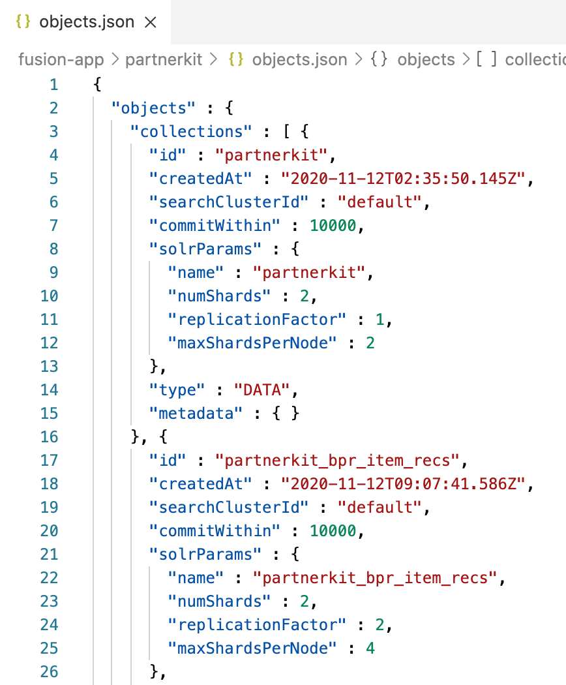|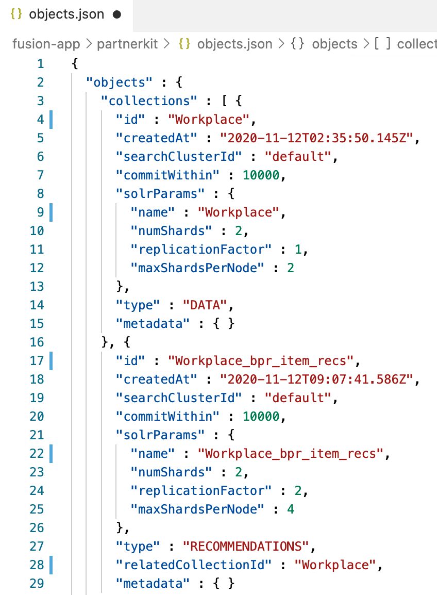|

### 3. Fusion 앱 템플릿 가져오기

> Fusion 관리자 화면 (Admin UI)에 익숙하지 않은 경우 [General UI Overview](https://doc.lucidworks.com/fusion-server/5.3/concepts/general-ui-overview.html)를 참조하십시오.

Fusion 앱 가져오기(Import) 기능을 활용하여 새로운 Fusion 앱 생성.

1. Fusion 관리자 화면 (Admin UI) 로그인
2. **Import app** 클릭
    <!--  -->
    <br>
3. **Data File** 에 `object.json` 선택
    <!--  -->
    <br>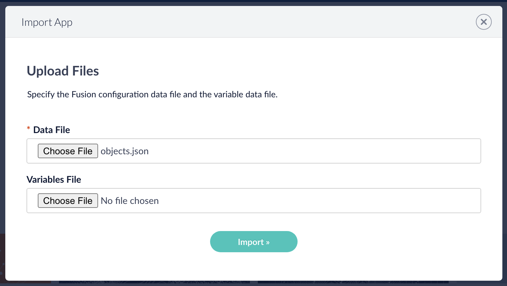
4. **Import** 클릭
5. 앱 가져오기가 정상적으로 완료되었는지 확인
    <br>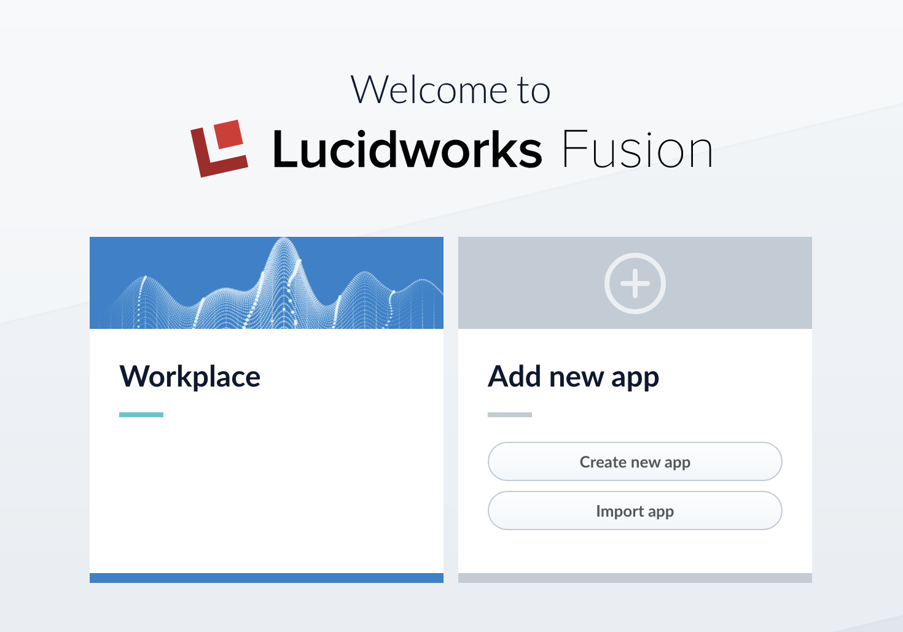

### 4. 데이터소스 실행

> Fusion Datasources 및 Jobs에 익숙하지 않은 경우 [Datasources](https://doc.lucidworks.com/fusion-connectors/5.3/concepts/datasources.html) 와 [Jobs](https://doc.lucidworks.com/fusion-server/5.3/concepts/jobs/index.html)를 참조하십시오. <br>
> 데모를 설정하기 위해 Fusion Datasources 및 Jobs에 대한 이해가 필요하지는 않습니다.


1. Fusion 관리자 화면 (Admin UI) 로그인
2. 런처에서 새로 만든 Fusion App의 워크스페이스로 들어가기
    <br>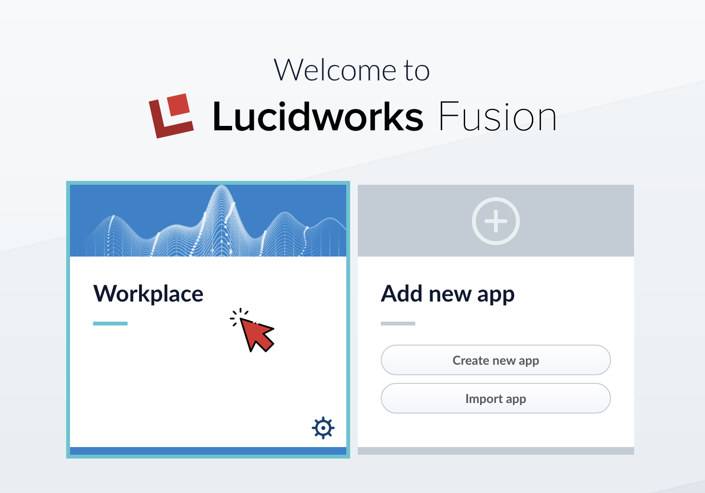
3. 왼쪽 탐색 메뉴에서 **INDEXING** > **Datasources** 클릭
    <br>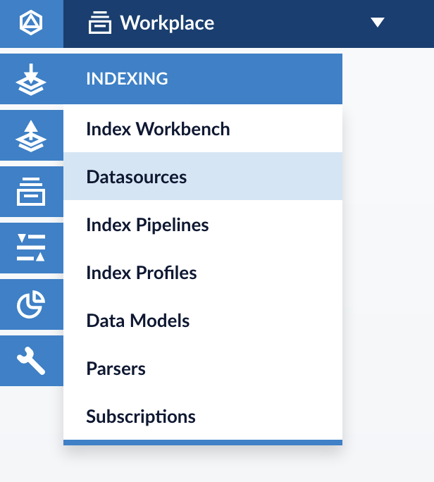
4. **web** 데이터소스 클릭

5. **Run** > **Start** 클릭
    <br>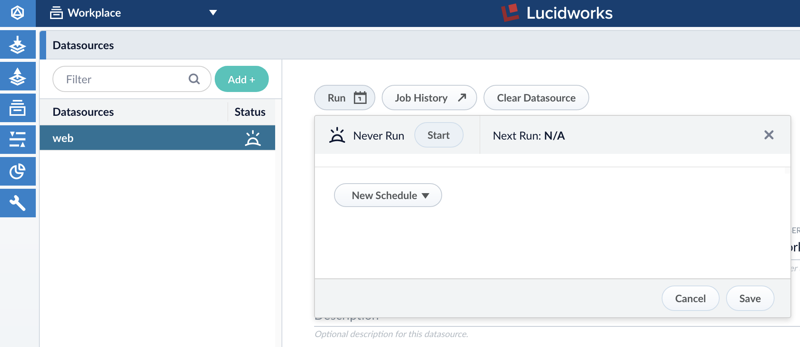
6. **Job History** 클릭하여 Job 로그 확인
    <br>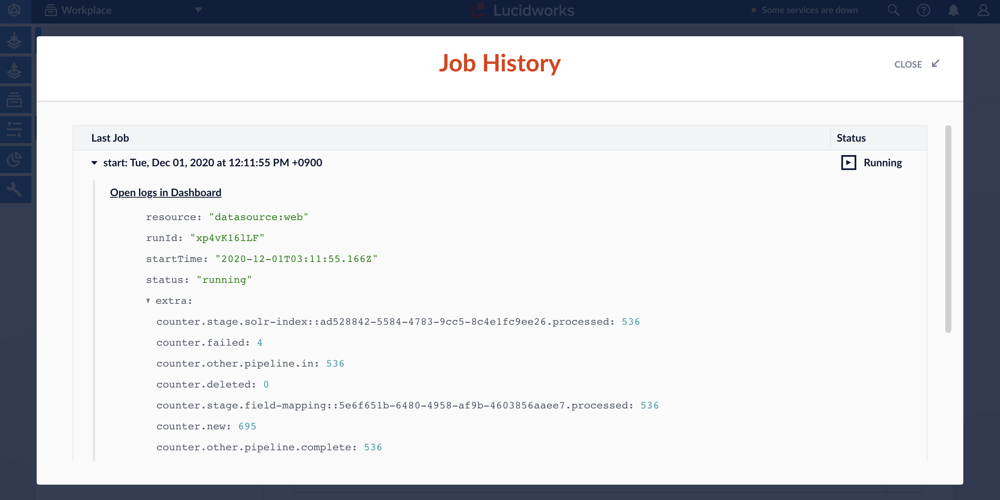
7. Job 실행이 완료되면 작업 상태가 변경된 것을 확인
    <br>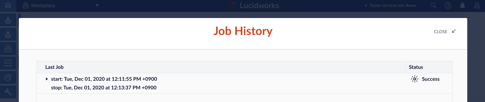
8. **QUERYING** > **Query Workbench** 로 이동
    <br>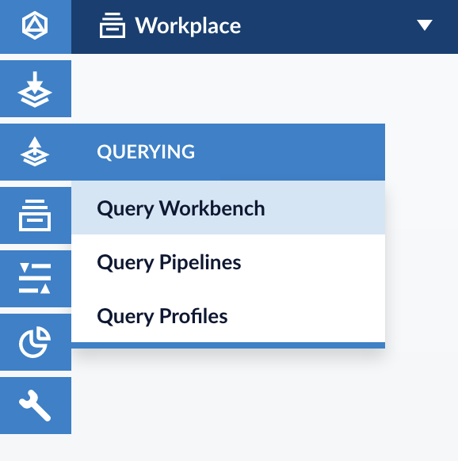
9. 데이터 소스가 성공적으로 실행 된 경우 쿼리 워크 벤치는 다음과 유사한 검색 결과를 시뮬레이션해야합니다:
    <br>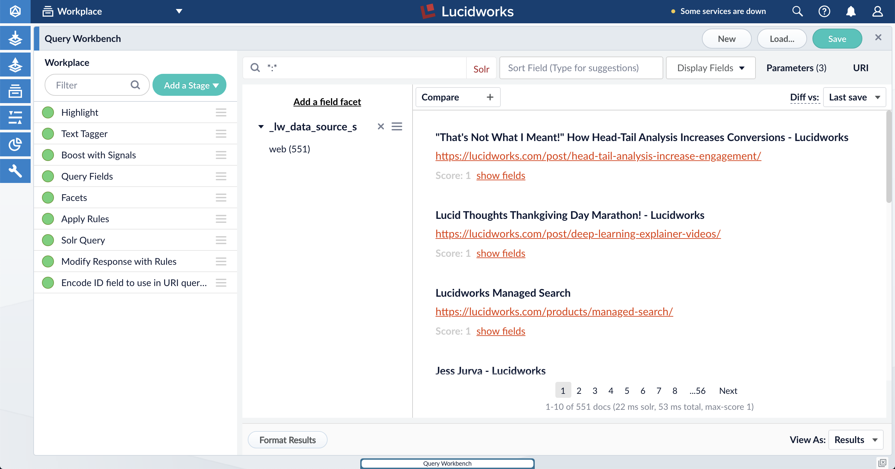


### 5. Signal 생성

> Signals에 익숙하지 않은 경우 [Signals Overview](https://doc.lucidworks.com/fusion-ai/5.3/concepts/signals-and-aggregations/signals/index.html)를 참조하십시오. <br>
> 데모를 설정하기 위해 Signals에 대한 이해가 필요하지는 않습니다.

1. `sample-code` 폴더에 위치한 [generate-signals-threaded.py](./sample-code/generate-signals-threaded.py) 파일을 열고 아래 값들을 필요에 따라 수정하세요:

    | Variable                | Description           |
    | :----------------       | :-------------------- |
    |**fusion_ip**            |Fusion host|
    |**fusion_port**          |Fusion port|
    |**fusion_user**          |Fusion username|
    |**fusion_password**      |Fusion password|
    |**fusion_app**           |Fusion App name|
    |**fusion_query_profile** |검색을 처리할 Query Profile|
    |**fusion_collection**    |검색 대상 document 들어 있는 Collection 명|
    |**documentLabel**        |Document 레이블이 포함 된 필드의 이름 (일반적으로 파일 이름 또는 제품명). 템플릿에 제공된 인덱스 파이프 라인을 사용하는 경우이 값을 변경하지 마십시오|

    <br>

    예를 들어 [2. Fusion 앱 템플릿 준비](#2-prepare-fusion-app-template) 단계에서 Fusion App 이름을 "Workplace"로 지정한 경우, `fusion_app`, `fusion_query_profile`, `fusion_collection`의 값은 "Workplace"입니다.

2. [generate-signals-threaded.py](../sample-code/generate-signals-threaded.py) 실행

    ```sh
    $ python3 sample-code/generate-signals-threaded.py
    ```
    
3. Fusion 관리자 화면(Admin UI)으로 이동하여, **Collection Picker** 클릭 후 **[FUSION-APP-NAME]_signals** 선택
    <br>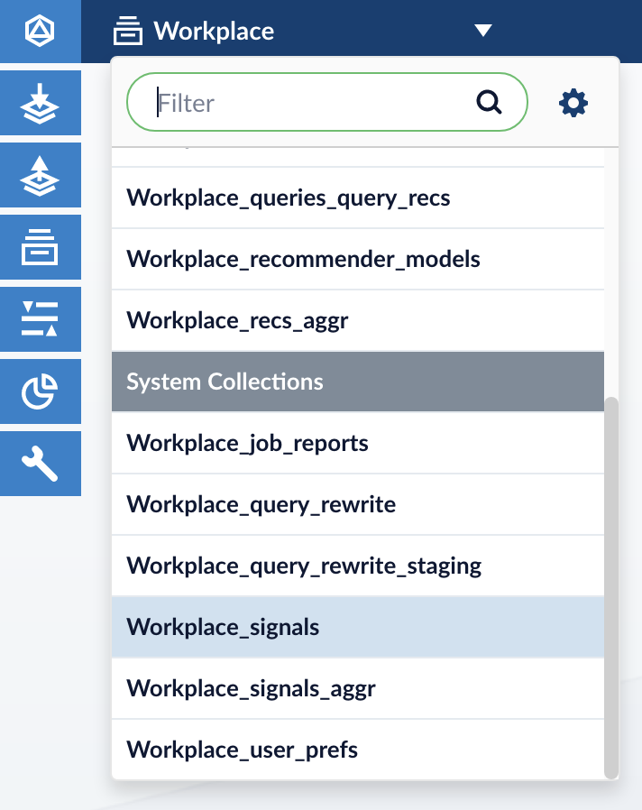

4. 왼쪽 메뉴에서 **QUERYING** > **Query Workbench** 로 이동
   <br>Signal이 성공적으로 수집되었는지 확인
    <br>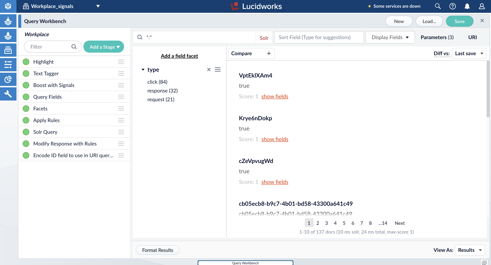

### 6. 추천 데이터 생성

> Recommendations에 익숙하지 않은 경우 [Recommendations and Boosting Overview](https://doc.lucidworks.com/fusion-ai/5.3/concepts/boosting/index.html)를 참조하십시오. <br>
> 데모를 설정하기 위해 Recommendations에 대한 이해가 필요하지는 않습니다.

이전에 생성 한 시그널(signal)을 사용하여 검색 관련성/연관성과 검색경험을 향상시키기 위해 일부 데이터 집계 및 추천 데이터를 만들 것입니다. **COLLECTIONS** > **Jobs** 으로이동하여 주어진 순서대로 아래 작업을 실행합니다.

**참고 : 현재 작업이 성공적으로 완료된 후에만 다음 작업을 진행합니다.**

1. [FUSION-APP-NAME]_click_signals_aggregation
2. [FUSION-APP-NAME]_user_query_history_agg
3. [FUSION-APP-NAME]_user_item_prefs_agg
4. [FUSION-APP-NAME]_bpr_item_recs
5. [FUSION-APP-NAME]_content_recs
6. [FUSION-APP-NAME]_query_recs

모든 작업을 실행 한 후 **COLLECTIONS** > **Collection Manager** 로 이동하여 다른 컬렉션(collection)에 document가 있는지 확인합니다.

Example:
<br>

### 7. App Studio 실행

> App Studio에 익숙하지 않은 경우 [Fusion App Studio](https://doc.lucidworks.com/app-studio/latest/index.html)를 참조하십시오. <br>
> 데모를 설정하기 위해 App Studio에 대한 이해가 필요하지는 않습니다.

이 스타터 템플릿은 Appkit 버전 4.11.0을 사용하는 App Studio Enterprise (ASE) 4.11.0의 수정 된 버전입니다. 원본 ASE 패키지는 [여기](https://doc.lucidworks.com/app-studio/4.2/concepts/app-studio-enterprise/download.html)에서 다운로드 할 수 있습니다 또한 [How to upgrade Appkit](https://doc.lucidworks.com/how-to/upgrade-appkit.html)에서 App Studio 프로젝트의 Appkit 버전을 업그레이드 하는 방법을 확인하실 수 있습니다.

**참고: Fusion 4.x, 5.0.x 및 5.1.x는 Appkit 버전 4.10.0 및 이전 버전과 호환됩니다.**

아래 실행 방법은 개발환경에서 테스트를 하는 단계에서 사용하시고 개발이 완료된 후에 실제 production에 배포할 시에는 Java WAR 또는 Java JAR로 배포하십시오. 자세한 내용은 [Deployment Overview](https://doc.lucidworks.com/app-studio/4.2/reference/app-deployment/index.html)를 참고하세요.

**참고: App Studio를 실행하려면 `npm`이 필요합니다**

`npm` 설치를 위해 아래 명령을 실행하십시오:
```
$ curl -sL https://rpm.nodesource.com/setup_12.x | sudo bash -
$ sudo yum install nodejs
```

`app-studio` 폴더로 이동하여 App Studio 실행:
```
$ cd app-studio/
$ ./app-studio start -t 300
```

`-t` 플래그는 선택 사항이며 시작 시간 제한을 초 단위로 설정하는 데 사용됩니다. 기본 시간 제한은 240 초이며, 처음에 다양한 모듈을 다운로드해야하므로 App Studio를 처음 시작할 때 충분하지 않을 수 있습니다.

**Example screenshots of App Studio search UI**

|Summary Page |
|:-----------:|
|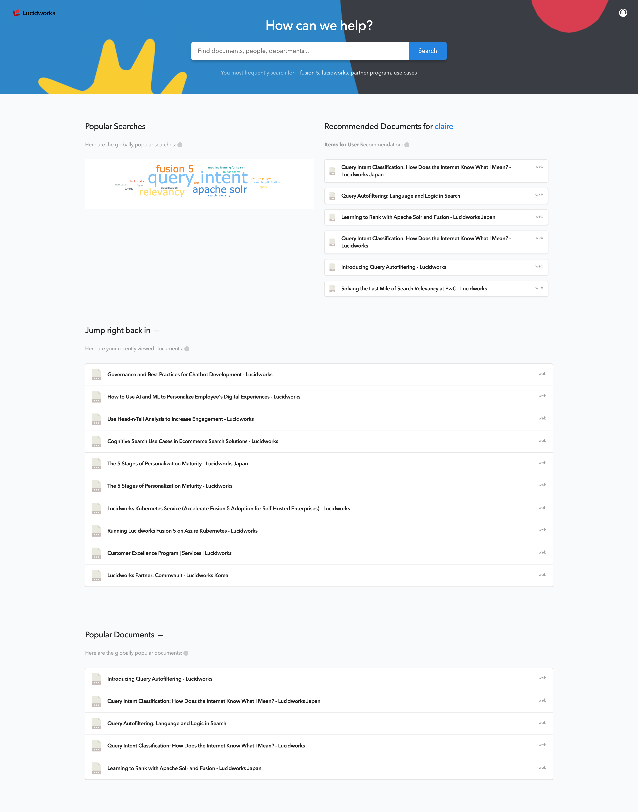|

|Main Search Page | Search Detail Page|
|-----------|---------------|
|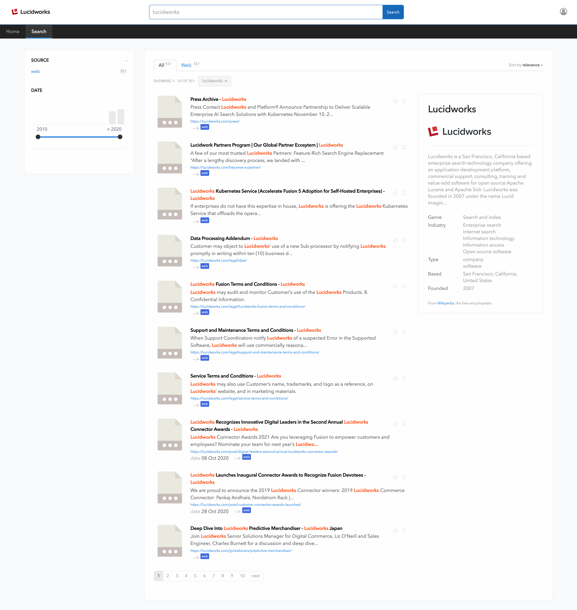|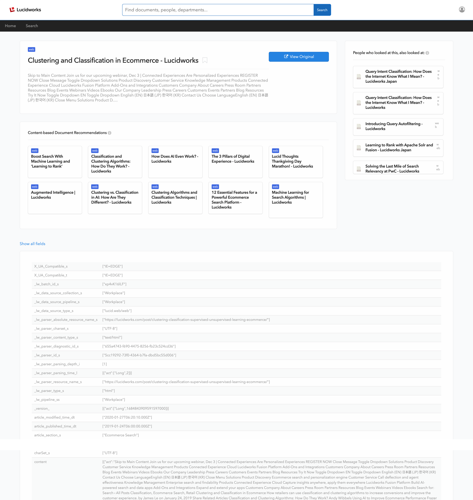|

|Typeahead |
|-----------|
|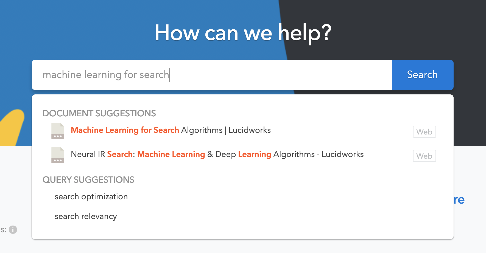|
